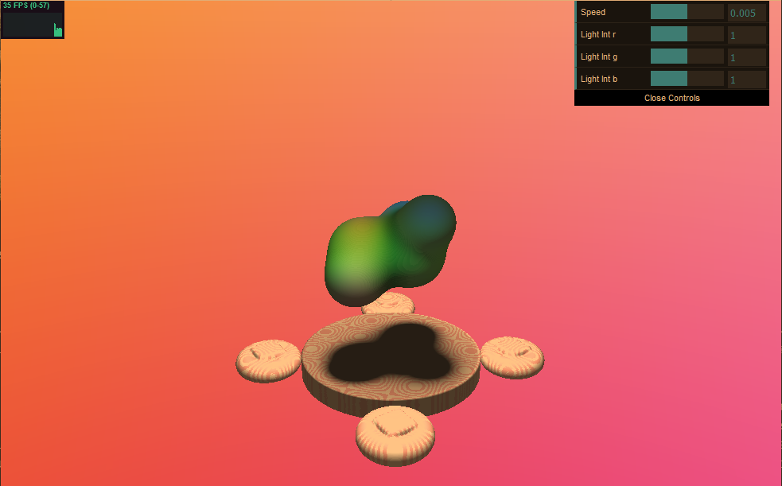
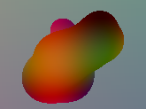
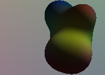
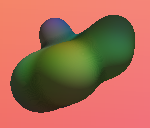
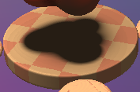
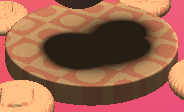
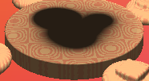
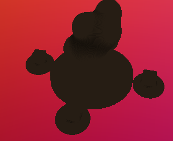
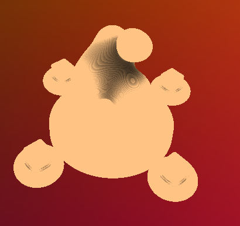

# CIS 566 Homework 2: Implicit Surfaces
Jason Wang (jasonwa)

Warning, scene is a bit slow. Reducing resolution/using Firefox will make the experience better.

Demo: https://jwang5675.github.io/hw02-raymarching-sdfs/

Sources:
  - The math for SDFs/Normals/Extra Credit info was adopted from class slides or from http://www.iquilezles.org/
  - The function used to derive the normals for metaballs are from: http://blackpawn.com/texts/metanormals/default.html

## Features Implemented
Here is a high-level overview of implemented features

Ray Casting:
- Changed fragment's fs_Pos to NDC coordinates to cast rays into the scene. 

Scene:
- Used SDF combinations for intersection and smooth blend for rising pistons circling the floor in the scene.
- Used bounding boxes to first test for ray and cube intersection before ray marching in the scene to optimize for bounding volumes. This significantly speeds up the ray marching step.
- Implemented animation for movement and color of the scene.
- Used two types of functions for animation: sin/cos trig functions for rotational movement over time and parabola function for up and down movement of the metaballs movement and pistons. This will be explained more in detail below.
- Used a checkerboard abs() pattern and sin/cos curves with color from the toolbox functions to implement the white and pink texture on the round floor and pistons in the scene.
- Used normals for shading in the scene which includes penumbra shadows, ambient occlusion, and lambert lighting for the scene.

Gui:
  - Added Light Intensity to the gui to allow the user to change the lambert light intensity within the scene
  - Added a speed function to speed up the animation in scene

Extra Credit:
  - Added soft shadows with prenumbra shadows
  - Added ambient occlusion to the scene with 5-tap AO

## Implementation Details

There are 4 main aspects of the scene. I will discuss them in detail below.

Metaballs:
- The metaballs sdf in the scene are implemented with a slight modification to sphere sdfs. One implementation of sphere sdfs is to check if the radius of the sphere squared divided by the relative distance squared of the point sample to the center of the sphere is greater than 1. My implemented of the metaballs follows by summing up all the sphere sdfs representing metaballs and checking if this value is greater than one. This implementation is modelled from the formula of electrical fields. 
- Since the sdf for the metaballs can cause the distance field to increase/decrease a lot, I had to use a different computation for normals to determine the normals of the metaballs. I followed the math derived from this link to find the normals for my metaballs. http://blackpawn.com/texts/metanormals/default.html
- The base coloring for the metaballs follows from smooth sin/cos animations of color over time based on the metaball's position. The lighting color on the metaballs which create the shadows are calculated with Lambertian lighting and special 5 tap ambient occlusion. Lambertian lighting is calculated by finding the intensity of the light with the relative angle between the light ray of the scene and the normal of the object with the dot product. Then, the light intensity multiplied with the base color of the metaball to produce smooth shadows. In addition, there is some ambient lighting added with 5 tap AO. This is accomplished by 5 additional ray marching samples from the intersection of the metaballs along the metaballs' normal. We sample the SDF along the normal with exponentially decreasing weights to fake the ambient occlusion.
- The movement of the metaballs is based off smooth scaling of time with sin and cos functions. You can modify the speed at which the metaballs move with the speed parameter within the gui. This is accomplished by multiplying the initial position of the metaball by cos(time * speed) and sin(time * speed) to get a smooth movement. 

metaball base color

metaball with lambert

metaball with lambert and ambient occlusion

Circular Floor:
- The floor is a simple cylinder sdf. The math to compute the sdf for the cylinder can be found at http://www.iquilezles.org/
- The movement of the cylinder is a simple rotation along the y-axis where the degree of rotation varies over time.
- The base color of the floor is determined by taking the mod of the sum of a sin(pos.x) + sin(pos.z) and then flooring the result. This works because as the position changes over time, the sin grows towards 1 or -1 as decimals. When you floor the results, it will always repeat along this 1 or -1 resulting a period of repeated patterns. This creates the initial checker board coloring within the floor. To add the circles, I multiplied the sin(pos.x) + sin(pos.z) by a constant. Here is the math I used: floor(mod(constant * (sin(point.x * 2.0) + sin(point.z * 2.0)), 2.0));
- Besides the base color, there is also lambert light applied to the floor. The math for lambert shading is talked about above.
- There are also soft shadows from the metaballs implemented with penumbra shadows applied to the floor. The math behind this can be found at: https://iquilezles.org/www/articles/rmshadows/rmshadows.htm.

floor color constant = 0.5, floor(mod(constant * (sin(point.x * 2.0) + sin(point.z * 2.0)), 2.0));

floor color constant = 1, floor(mod(constant * (sin(point.x * 2.0) + sin(point.z * 2.0)), 2.0));

floor color constant = 4, floor(mod(constant * (sin(point.x * 2.0) + sin(point.z * 2.0)), 2.0));

Rising Pistons:
- The sdf for the pistons is the intersect between a cube and a torus.
- The color of the piston is the same as the floor talked about above. The only thing that is added to the piston is 5tap AO explained in the metaball step. 
- The rotating movement of the pistons is accomplished by rotating the point sampled along the y axis before translating the piston.
- The cube translation up and down on the piston is accomplish by using a parabola scale over time. This allows the piston to look like it's being turned 'on and off' instead of having a smooth transition up and down over time. In addition, the cube of the piston rotates along its personal axis which is accomplished by rotating the cube before translation.

Ambient Occlusion:
- Ambient occlusion is added to the scene with 5tap AO. You can easily see the effects of AO by turning all the light intensity in the gui to 0. 

- From the above picture, we can see that adding ao to the scene adds a bit of light to the sdfs. In addition, you can see where the normal are close and run into other sdf shapes have much darker shadows compared to the ambient light added to the objects. Here is a scaled up ao where it is easier to see the effects of the ao.

